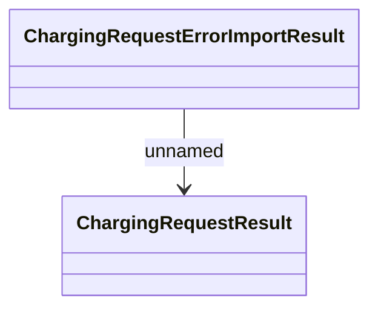

# ChargingRequestResult

```mermaid
classDiagram
    class ChargingRequestErrorImportResult["ChargingRequestErrorImportResult"]
    class ChargingRequestResult["ChargingRequestResult"]
    ChargingRequestErrorImportResult --> ChargingRequestResult : unnamed
```
