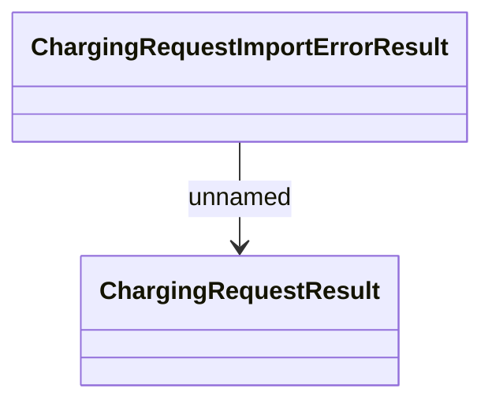

# ChargingRequestsImportResult

```mermaid
classDiagram
    class ChargingRequestImportErrorResult["ChargingRequestImportErrorResult"]
    class ChargingRequestResult["ChargingRequestResult"]
    ChargingRequestImportErrorResult --> ChargingRequestResult : unnamed
```
