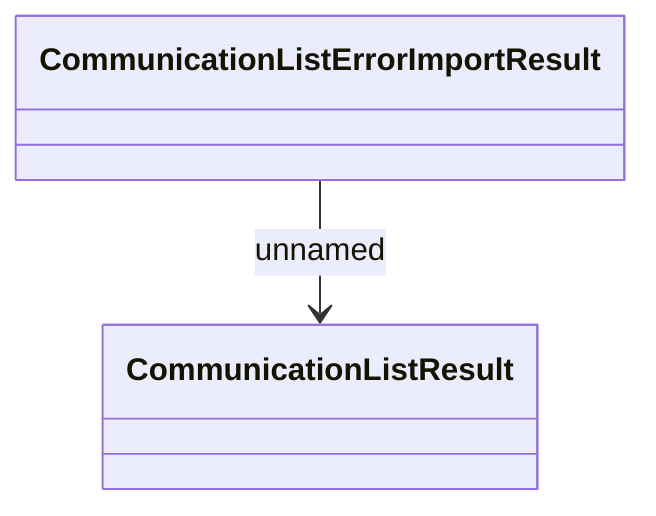

# CommunicationListResult

```mermaid
classDiagram
    class CommunicationListErrorImportResult["CommunicationListErrorImportResult"]
    class CommunicationListResult["CommunicationListResult"]
    CommunicationListErrorImportResult --> CommunicationListResult : unnamed
```
