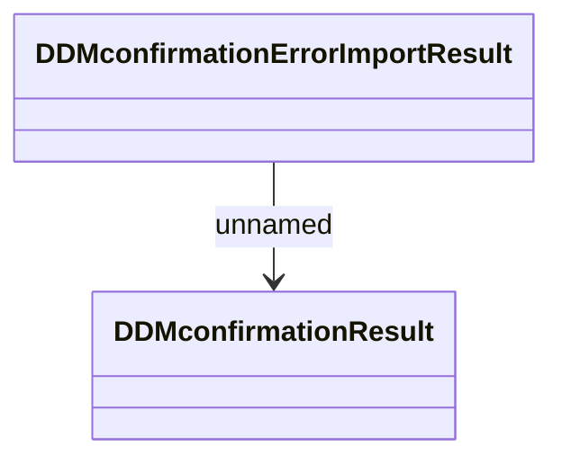

# DDMconfirmationResult 

```mermaid
classDiagram
    class DDMconfirmationResult["DDMconfirmationResult"]
    class DDMconfirmationErrorImportResult["DDMconfirmationErrorImportResult"]
    DDMconfirmationErrorImportResult --> DDMconfirmationResult : unnamed
```
