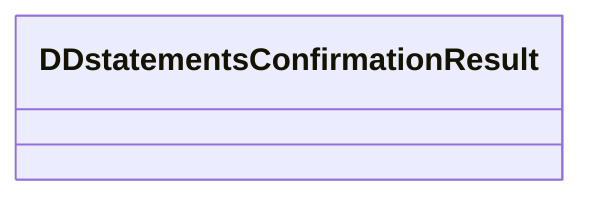

# DDstatementsConfirmationResult

- **Diagram Type**: Logical
- **Package**: HomerSelect/BSL/Analysis Model/_Interface/Consumed services/Automatic Import response/DDStatementsConfirmationResult
- **Diagram ID**: 40197
- **Elements**: 1
- **Connectors**: 0

