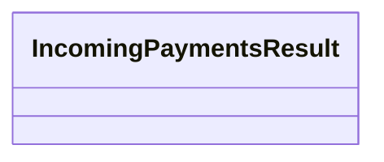

# IncomingPaymentsResult

- **Diagram Type**: Logical
- **Package**: HomerSelect/BSL/Analysis Model/_Interface/Consumed services/Automatic Import response/IncomingPaymentsResult
- **Diagram ID**: 40199
- **Elements**: 1
- **Connectors**: 0

