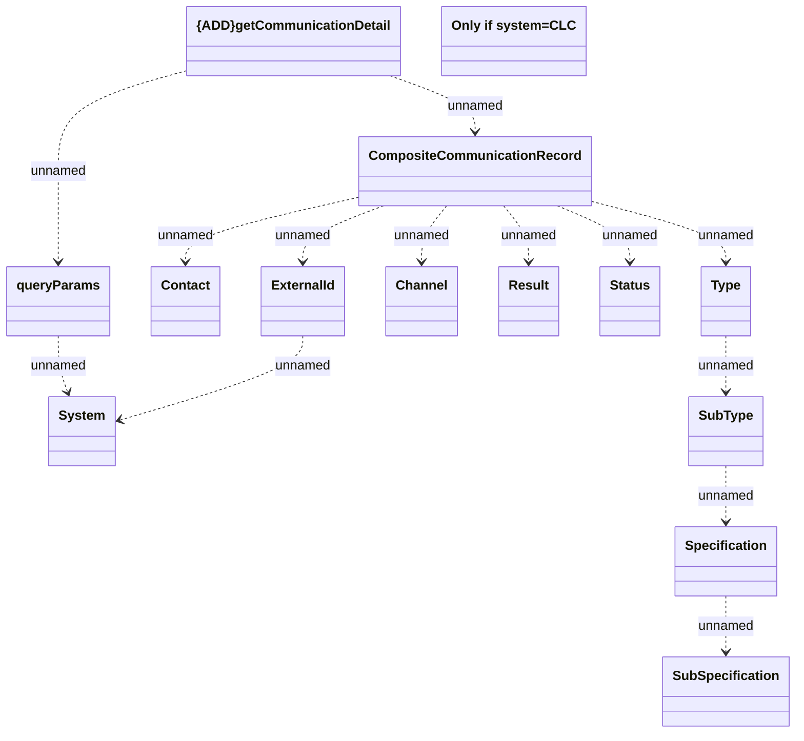

# getCommunicationDetail

- **Diagram Type**: Logical
- **Package**: HomerSelect/BSL/Analysis Model/_Interface/Consumed services/CLC/v1/getCommunicationDetail
- **Diagram ID**: 146725
- **Elements**: 14
- **Connectors**: 13

