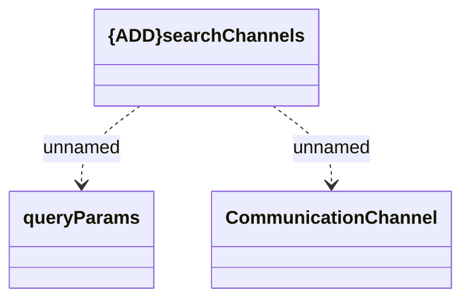

# searchChannels

- **Diagram Type**: Logical
- **Package**: HomerSelect/BSL/Analysis Model/_Interface/Consumed services/CLC/v1/searchChannels
- **Diagram ID**: 146781
- **Elements**: 3
- **Connectors**: 2

