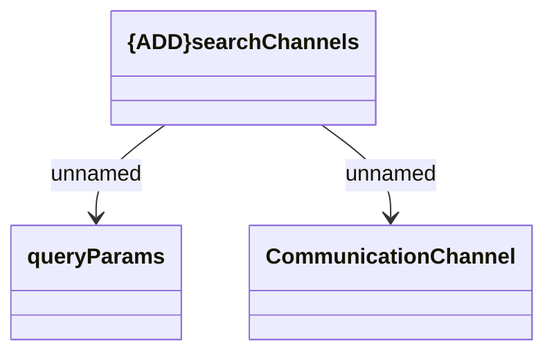

# searchChannels

```mermaid
classDiagram
    class queryParams["queryParams"]
    class CommunicationChannel["CommunicationChannel"]
    class ADD_searchChannels["{ADD}searchChannels"]
    ADD_searchChannels --> queryParams : unnamed
    ADD_searchChannels --> CommunicationChannel : unnamed
```
