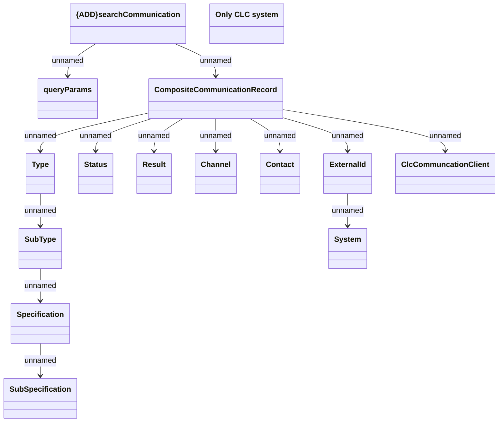

# searchCommunication

```mermaid
classDiagram
    class queryParams["queryParams"]
    class ADD_searchCommunication["{ADD}searchCommunication"]
    class SubSpecification["SubSpecification"]
    class Specification["Specification"]
    class SubType["SubType"]
    class Type["Type"]
    class Status["Status"]
    class Result["Result"]
    class Channel["Channel"]
    class Contact["Contact"]
    class System["System"]
    class ExternalId["ExternalId"]
    class CompositeCommunicationRecord["CompositeCommunicationRecord"]
    class Only_CLC_system["Only CLC system"]
    class ClcCommuncationClient["ClcCommuncationClient"]
    CompositeCommunicationRecord --> ClcCommuncationClient : unnamed
    ADD_searchCommunication --> CompositeCommunicationRecord : unnamed
    CompositeCommunicationRecord --> ExternalId : unnamed
    ExternalId --> System : unnamed
    CompositeCommunicationRecord --> Contact : unnamed
    CompositeCommunicationRecord --> Channel : unnamed
    CompositeCommunicationRecord --> Result : unnamed
    CompositeCommunicationRecord --> Status : unnamed
    CompositeCommunicationRecord --> Type : unnamed
    Type --> SubType : unnamed
    SubType --> Specification : unnamed
    Specification --> SubSpecification : unnamed
    ADD_searchCommunication --> queryParams : unnamed
```
