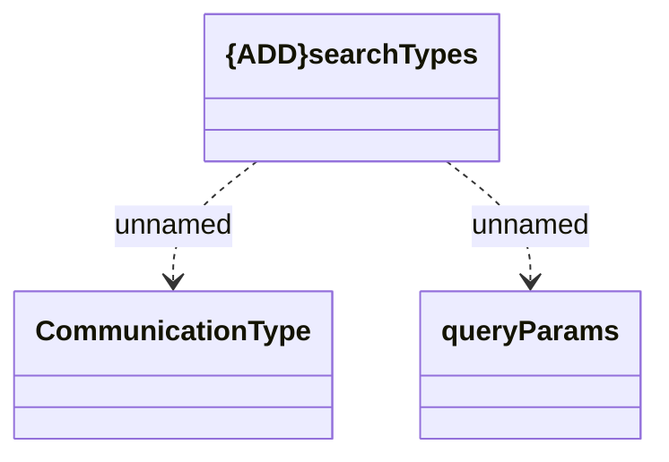

# searchTypes

- **Diagram Type**: Logical
- **Package**: HomerSelect/BSL/Analysis Model/_Interface/Consumed services/CLC/v1/searchTypes
- **Diagram ID**: 146783
- **Elements**: 3
- **Connectors**: 2

