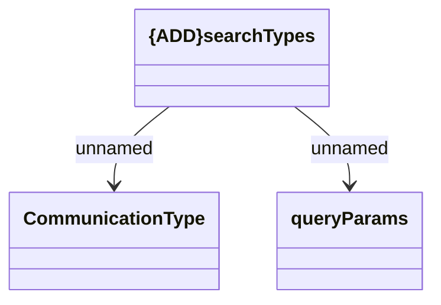

# searchTypes

```mermaid
classDiagram
    class queryParams["queryParams"]
    class CommunicationType["CommunicationType"]
    class ADD_searchTypes["{ADD}searchTypes"]
    ADD_searchTypes --> CommunicationType : unnamed
    ADD_searchTypes --> queryParams : unnamed
```
