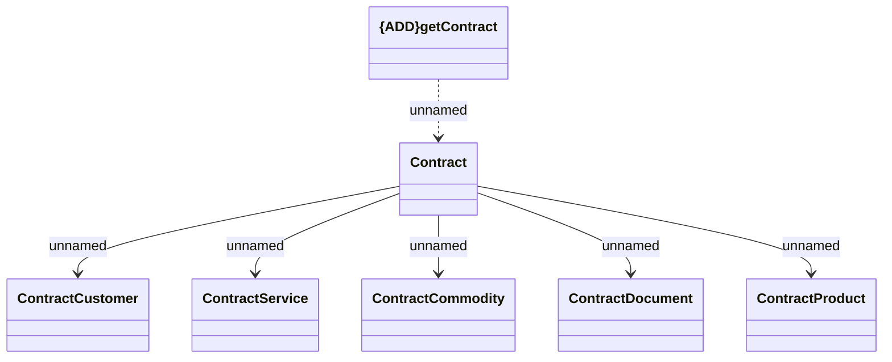

# getContract

- **Diagram Type**: Logical
- **Package**: HomerSelect/BSL/Analysis Model/_Interface/Consumed services/COMA/v12/getContract 
- **Diagram ID**: 146726
- **Elements**: 7
- **Connectors**: 6

