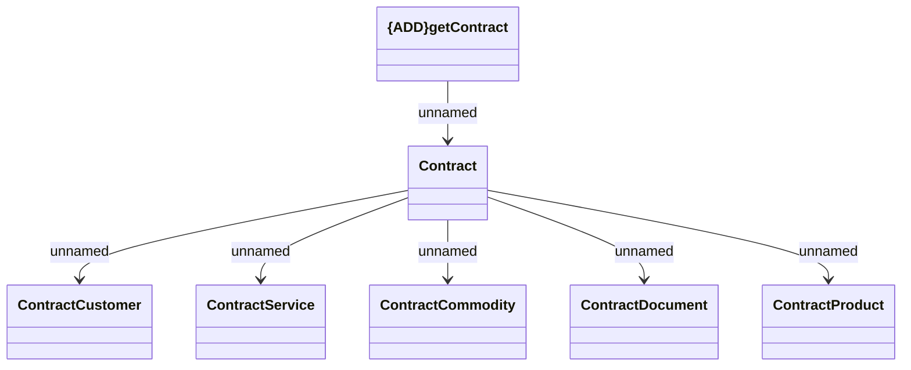

# getContract

```mermaid
classDiagram
    class ContractDocument["ContractDocument"]
    class ContractService["ContractService"]
    class ContractProduct["ContractProduct"]
    class ContractCustomer["ContractCustomer"]
    class ContractCommodity["ContractCommodity"]
    class Contract["Contract"]
    class ADD_getContract["{ADD}getContract"]
    ADD_getContract --> Contract : unnamed
    Contract --> ContractCustomer : unnamed
    Contract --> ContractService : unnamed
    Contract --> ContractCommodity : unnamed
    Contract --> ContractDocument : unnamed
    Contract --> ContractProduct : unnamed
```
