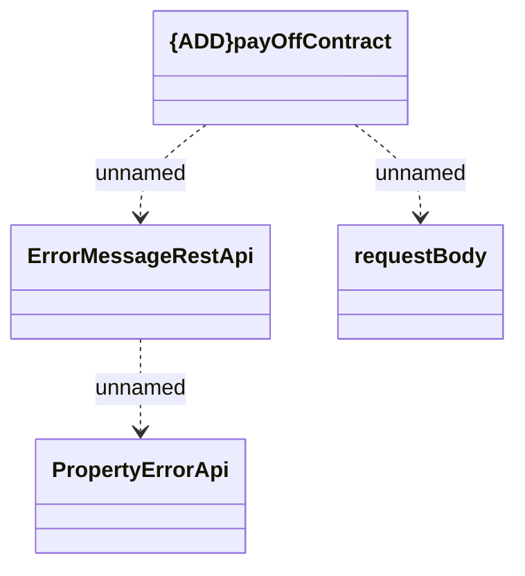

# payOffContract

- **Diagram Type**: Logical
- **Package**: HomerSelect/BSL/Analysis Model/_Interface/Consumed services/COMA/v12/payOffContract
- **Diagram ID**: 149039
- **Elements**: 4
- **Connectors**: 3

