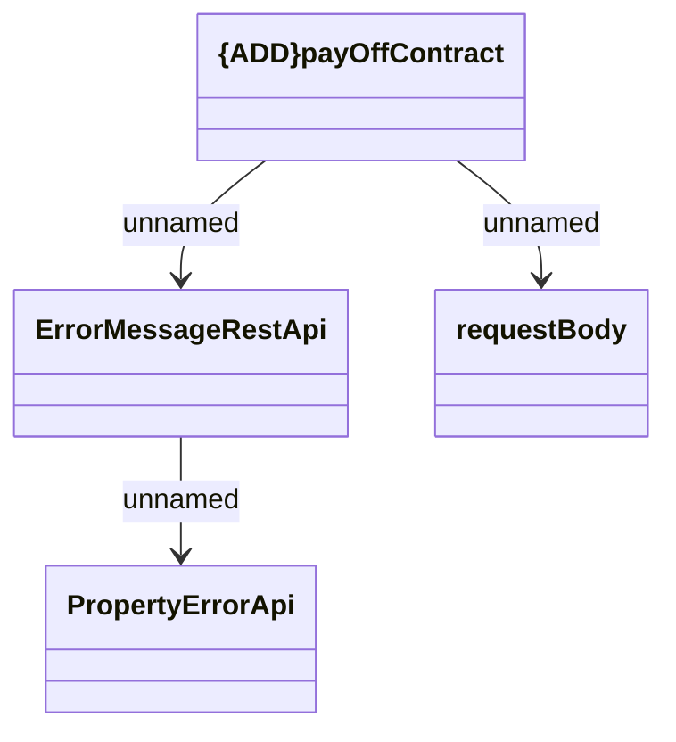

# payOffContract

```mermaid
classDiagram
    class PropertyErrorApi["PropertyErrorApi"]
    class ErrorMessageRestApi["ErrorMessageRestApi"]
    class requestBody["requestBody"]
    class ADD_payOffContract["{ADD}payOffContract"]
    ADD_payOffContract --> requestBody : unnamed
    ADD_payOffContract --> ErrorMessageRestApi : unnamed
    ErrorMessageRestApi --> PropertyErrorApi : unnamed
```
