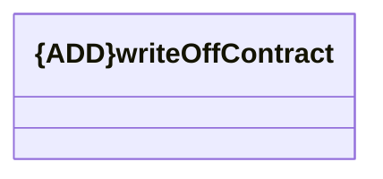

# writeOffContract

- **Diagram Type**: Logical
- **Package**: HomerSelect/BSL/Analysis Model/_Interface/Consumed services/COMA/v12/writeOffContract
- **Diagram ID**: 146728
- **Elements**: 1
- **Connectors**: 0

