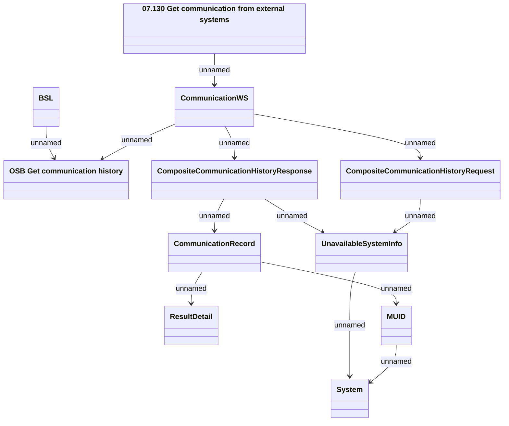

# CRM - communication - OSB

```mermaid
classDiagram
    class ResultDetail["ResultDetail"]
    class n_07_130_Get_communication_from_external_systems["07.130 Get communication from external systems"]
    class BSL["BSL"]
    class OSB_Get_communication_history["OSB Get communication history"]
    class UnavailableSystemInfo["UnavailableSystemInfo"]
    class MUID["MUID"]
    class CompositeCommunicationHistoryResponse["CompositeCommunicationHistoryResponse"]
    class CompositeCommunicationHistoryRequest["CompositeCommunicationHistoryRequest"]
    class CommunicationRecord["CommunicationRecord"]
    class System["System"]
    class CommunicationWS["CommunicationWS"]
    MUID --> System : unnamed
    UnavailableSystemInfo --> System : unnamed
    CompositeCommunicationHistoryResponse --> CommunicationRecord : unnamed
    CommunicationWS --> CompositeCommunicationHistoryRequest : unnamed
    CommunicationWS --> CompositeCommunicationHistoryResponse : unnamed
    CommunicationRecord --> MUID : unnamed
    CompositeCommunicationHistoryRequest --> UnavailableSystemInfo : unnamed
    CompositeCommunicationHistoryResponse --> UnavailableSystemInfo : unnamed
    CommunicationWS --> OSB_Get_communication_history : unnamed
    CommunicationRecord --> ResultDetail : unnamed
    n_07_130_Get_communication_from_external_systems --> CommunicationWS : unnamed
    BSL --> OSB_Get_communication_history : unnamed
```
