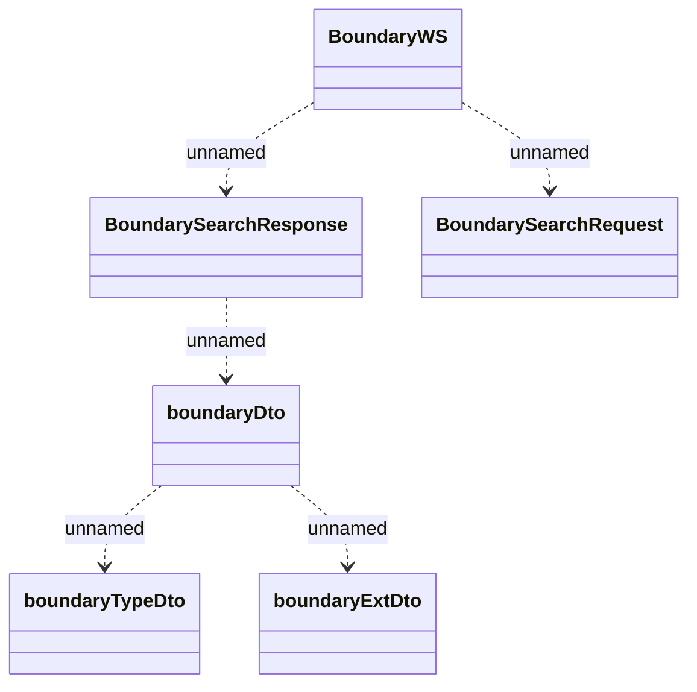

# Boundary

- **Diagram Type**: Logical
- **Package**: HomerSelect/BSL/Analysis Model/_Interface/Consumed services/CSD/Boundary
- **Diagram ID**: 122079
- **Elements**: 6
- **Connectors**: 5

```mermaid
classDiagram
    class boundaryExtDto["boundaryExtDto"]
    class boundaryTypeDto["boundaryTypeDto"]
    class boundaryDto["boundaryDto"]
    class BoundarySearchResponse["BoundarySearchResponse"]
    class BoundarySearchRequest["BoundarySearchRequest"]
    class BoundaryWS["BoundaryWS"]
    BoundaryWS ..> BoundarySearchRequest : unnamed
    BoundaryWS ..> BoundarySearchResponse : unnamed
    BoundarySearchResponse ..> boundaryDto : unnamed
    boundaryDto ..> boundaryTypeDto : unnamed
    boundaryDto ..> boundaryExtDto : unnamed
```
