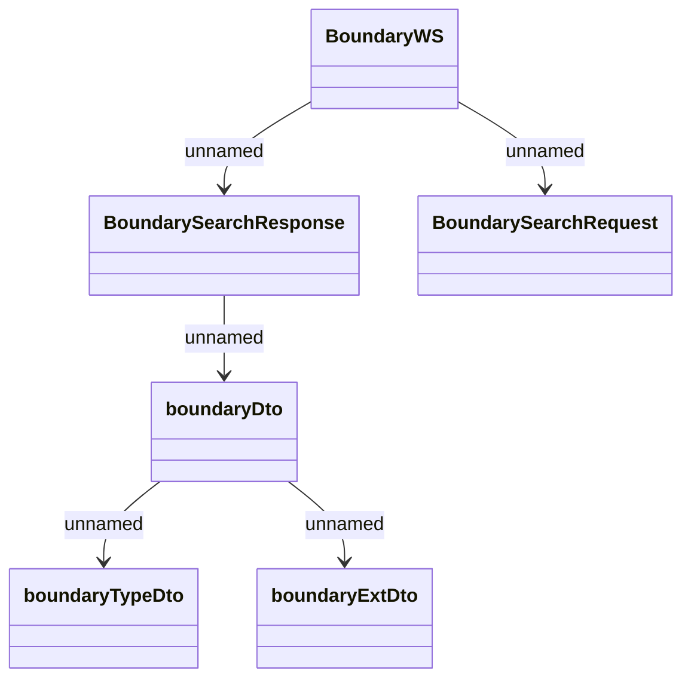

# Boundary

```mermaid
classDiagram
    class boundaryExtDto["boundaryExtDto"]
    class boundaryTypeDto["boundaryTypeDto"]
    class boundaryDto["boundaryDto"]
    class BoundarySearchResponse["BoundarySearchResponse"]
    class BoundarySearchRequest["BoundarySearchRequest"]
    class BoundaryWS["BoundaryWS"]
    BoundaryWS --> BoundarySearchRequest : unnamed
    BoundaryWS --> BoundarySearchResponse : unnamed
    BoundarySearchResponse --> boundaryDto : unnamed
    boundaryDto --> boundaryTypeDto : unnamed
    boundaryDto --> boundaryExtDto : unnamed
```
