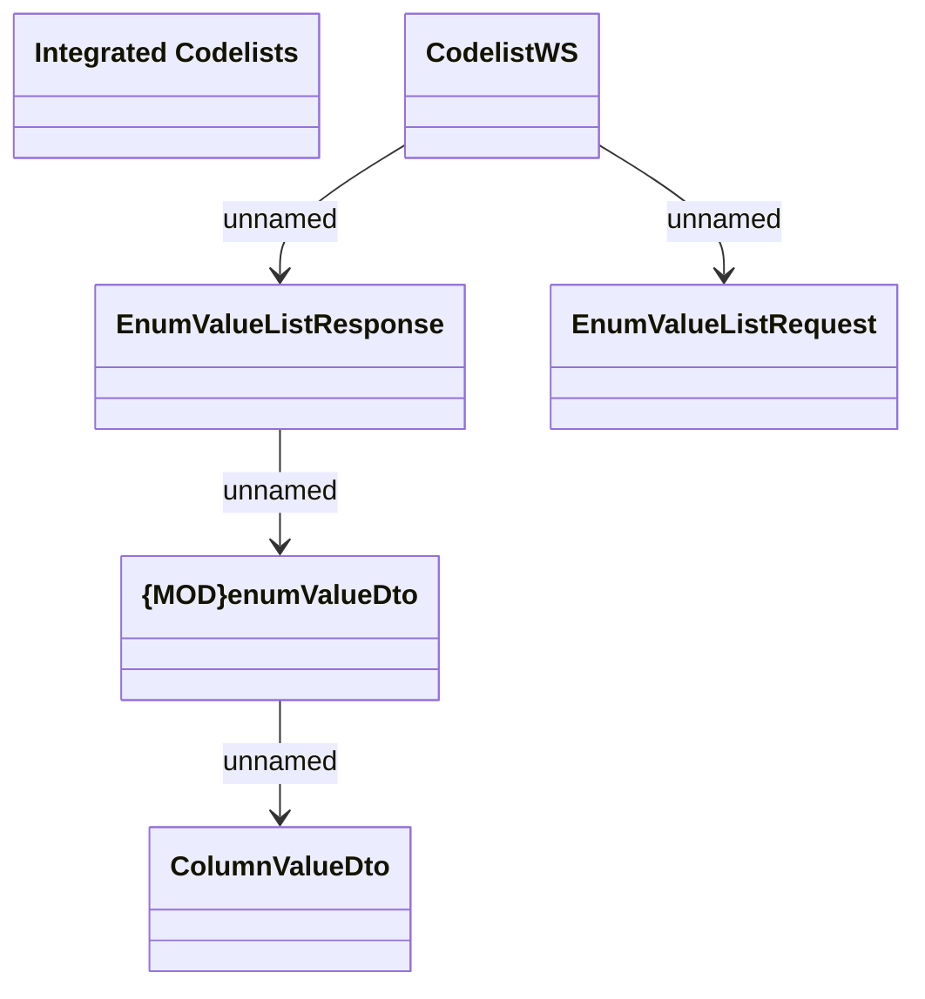

# CodelistWS

```mermaid
classDiagram
    class Integrated_Codelists["Integrated Codelists"]
    class ColumnValueDto["ColumnValueDto"]
    class MOD_enumValueDto["{MOD}enumValueDto"]
    class EnumValueListResponse["EnumValueListResponse"]
    class EnumValueListRequest["EnumValueListRequest"]
    class CodelistWS["CodelistWS"]
    CodelistWS --> EnumValueListResponse : unnamed
    CodelistWS --> EnumValueListRequest : unnamed
    EnumValueListResponse --> MOD_enumValueDto : unnamed
    MOD_enumValueDto --> ColumnValueDto : unnamed
```
