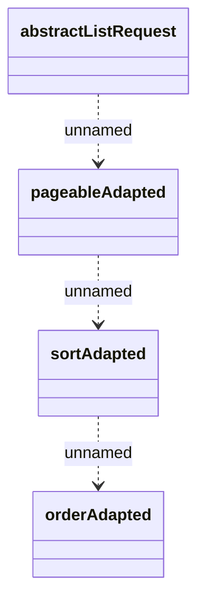

# Common - request

- **Diagram Type**: Logical
- **Package**: HomerSelect/BSL/Analysis Model/_Interface/Consumed services/CSD/Common
- **Diagram ID**: 122080
- **Elements**: 4
- **Connectors**: 3

