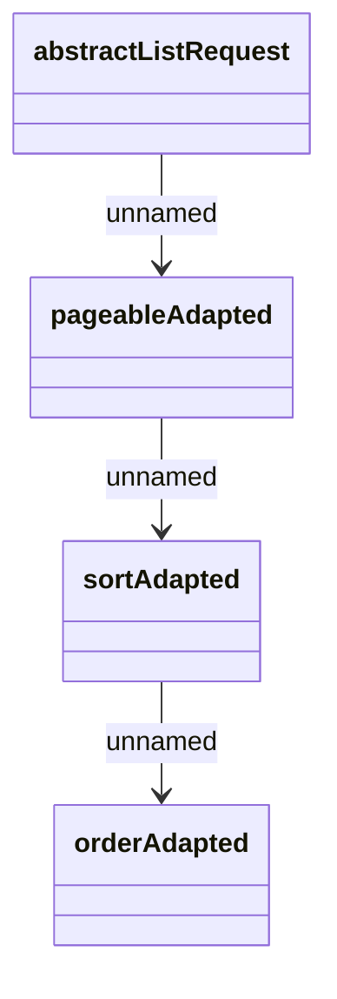

# Common - request

```mermaid
classDiagram
    class orderAdapted["orderAdapted"]
    class sortAdapted["sortAdapted"]
    class pageableAdapted["pageableAdapted"]
    class abstractListRequest["abstractListRequest"]
    abstractListRequest --> pageableAdapted : unnamed
    pageableAdapted --> sortAdapted : unnamed
    sortAdapted --> orderAdapted : unnamed
```
