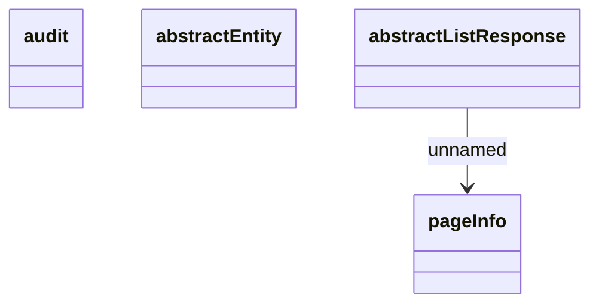

# Common - response

```mermaid
classDiagram
    class audit["audit"]
    class abstractEntity["abstractEntity"]
    class pageInfo["pageInfo"]
    class abstractListResponse["abstractListResponse"]
    abstractListResponse --> pageInfo : unnamed
```
