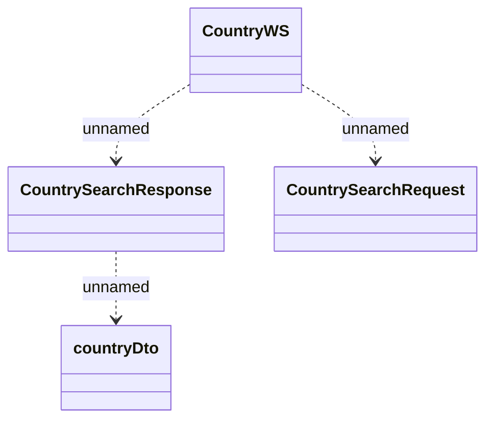

# Country

- **Diagram Type**: Logical
- **Package**: HomerSelect/BSL/Analysis Model/_Interface/Consumed services/CSD/Country
- **Diagram ID**: 122082
- **Elements**: 4
- **Connectors**: 3

```mermaid
classDiagram
    class countryDto["countryDto"]
    class CountrySearchResponse["CountrySearchResponse"]
    class CountrySearchRequest["CountrySearchRequest"]
    class CountryWS["CountryWS"]
    CountryWS ..> CountrySearchRequest : unnamed
    CountryWS ..> CountrySearchResponse : unnamed
    CountrySearchResponse ..> countryDto : unnamed
```
