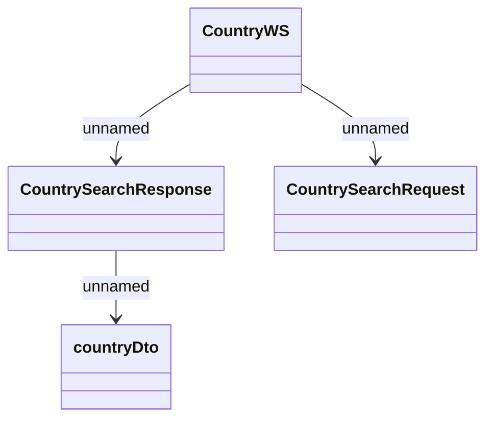

# Country

```mermaid
classDiagram
    class countryDto["countryDto"]
    class CountrySearchResponse["CountrySearchResponse"]
    class CountrySearchRequest["CountrySearchRequest"]
    class CountryWS["CountryWS"]
    CountryWS --> CountrySearchRequest : unnamed
    CountryWS --> CountrySearchResponse : unnamed
    CountrySearchResponse --> countryDto : unnamed
```
