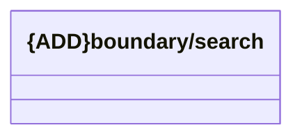

# Boundary/Search

- **Diagram Type**: Logical
- **Package**: HomerSelect/BSL/Analysis Model/_Interface/Consumed services/CSD/REST/v1/Boundary/Search
- **Diagram ID**: 138494
- **Elements**: 1
- **Connectors**: 0

