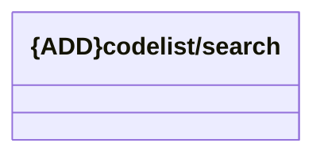

# Codelist/Search

- **Diagram Type**: Logical
- **Package**: HomerSelect/BSL/Analysis Model/_Interface/Consumed services/CSD/REST/v1/Codelist/Search
- **Diagram ID**: 138496
- **Elements**: 1
- **Connectors**: 0

