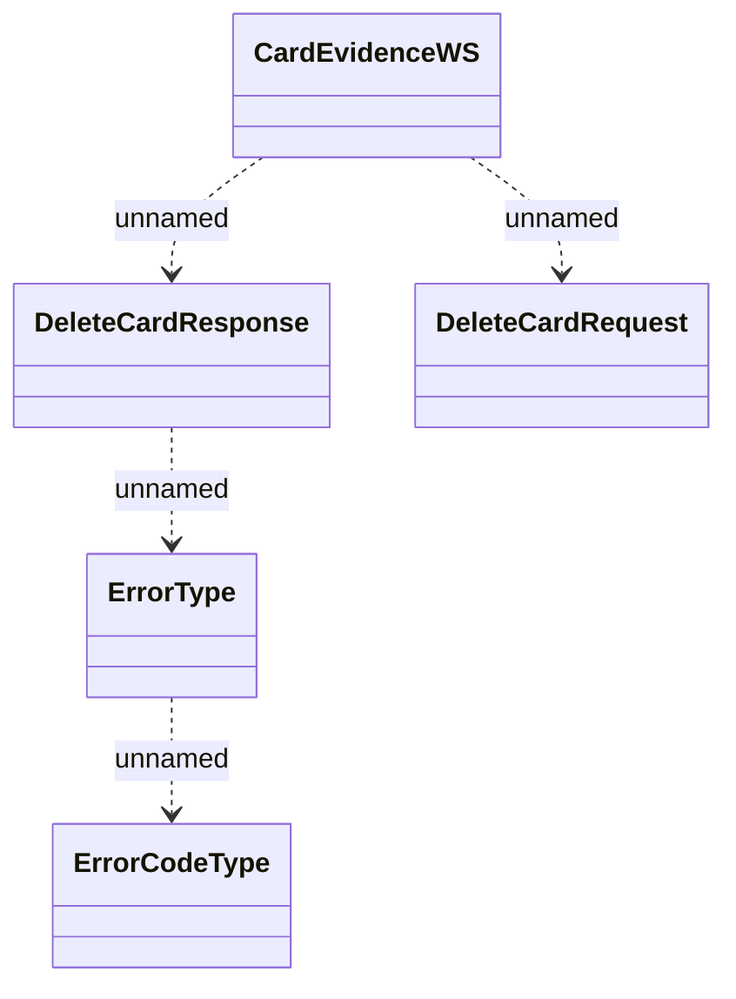

# CardEvidenceWS - DeleteCard

- **Diagram Type**: Logical
- **Package**: HomerSelect/BSL/Analysis Model/_Interface/Consumed services/Card Evidence System/CardEvidenceWS
- **Diagram ID**: 136015
- **Elements**: 5
- **Connectors**: 4

