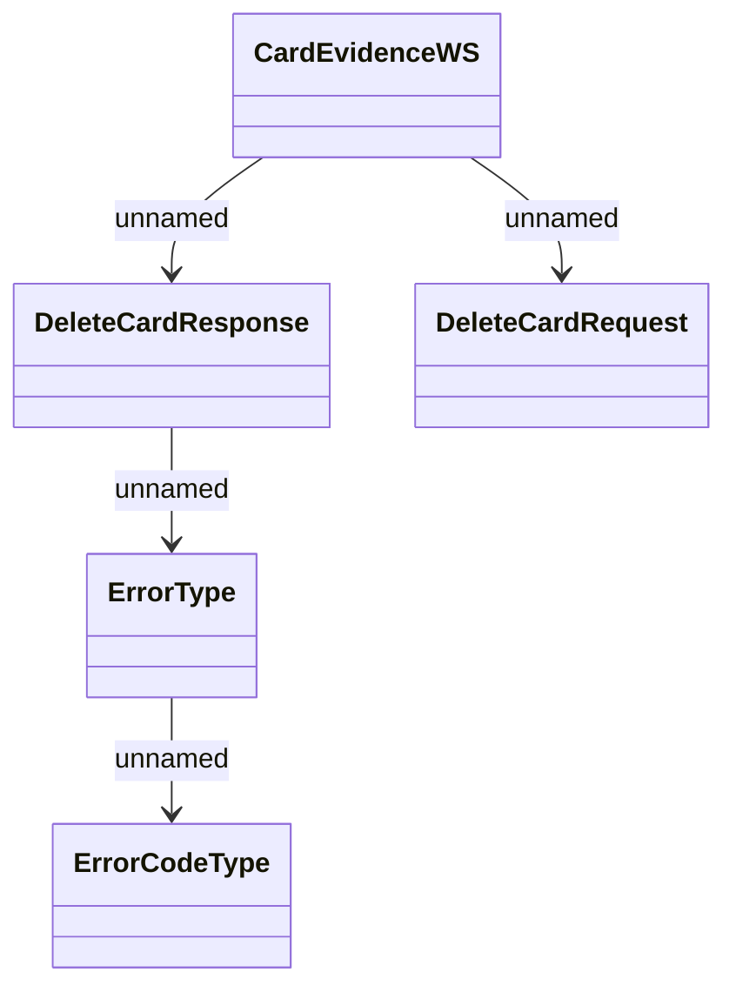

# CardEvidenceWS - DeleteCard

```mermaid
classDiagram
    class ErrorCodeType["ErrorCodeType"]
    class ErrorType["ErrorType"]
    class DeleteCardResponse["DeleteCardResponse"]
    class DeleteCardRequest["DeleteCardRequest"]
    class CardEvidenceWS["CardEvidenceWS"]
    CardEvidenceWS --> DeleteCardRequest : unnamed
    CardEvidenceWS --> DeleteCardResponse : unnamed
    DeleteCardResponse --> ErrorType : unnamed
    ErrorType --> ErrorCodeType : unnamed
```
