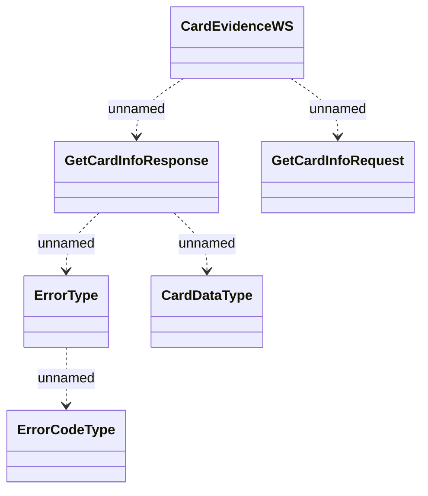

# CardEvidenceWS - GetCardInfo

- **Diagram Type**: Logical
- **Package**: HomerSelect/BSL/Analysis Model/_Interface/Consumed services/Card Evidence System/CardEvidenceWS
- **Diagram ID**: 136012
- **Elements**: 6
- **Connectors**: 5

