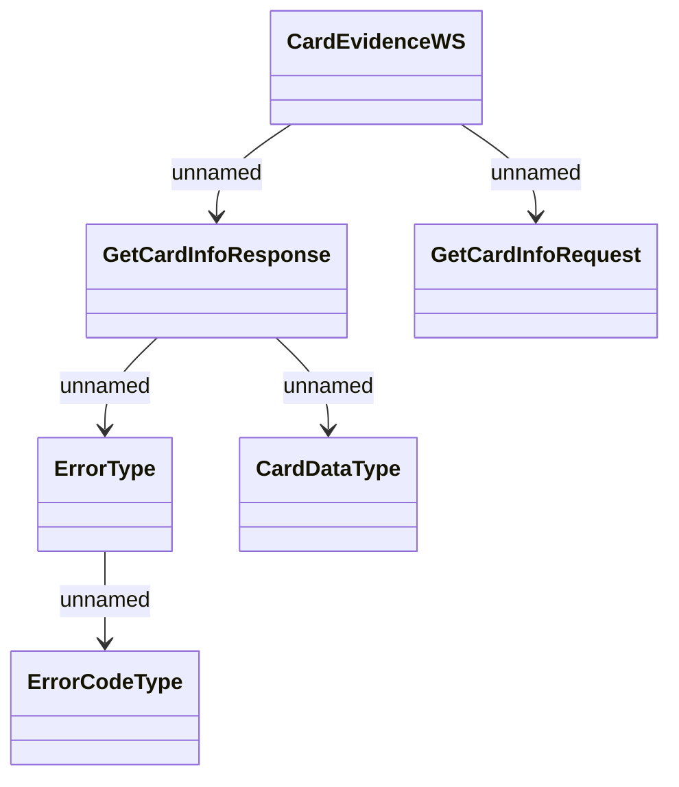

# CardEvidenceWS - GetCardInfo

```mermaid
classDiagram
    class ErrorType["ErrorType"]
    class CardDataType["CardDataType"]
    class ErrorCodeType["ErrorCodeType"]
    class GetCardInfoResponse["GetCardInfoResponse"]
    class GetCardInfoRequest["GetCardInfoRequest"]
    class CardEvidenceWS["CardEvidenceWS"]
    CardEvidenceWS --> GetCardInfoRequest : unnamed
    CardEvidenceWS --> GetCardInfoResponse : unnamed
    ErrorType --> ErrorCodeType : unnamed
    GetCardInfoResponse --> CardDataType : unnamed
    GetCardInfoResponse --> ErrorType : unnamed
```
