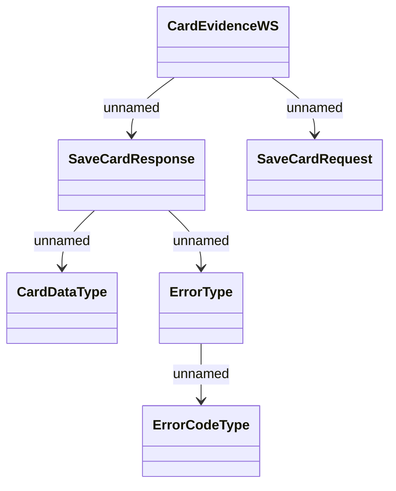

# CardEvidenceWS - SaveCard

```mermaid
classDiagram
    class CardDataType["CardDataType"]
    class ErrorCodeType["ErrorCodeType"]
    class ErrorType["ErrorType"]
    class SaveCardResponse["SaveCardResponse"]
    class SaveCardRequest["SaveCardRequest"]
    class CardEvidenceWS["CardEvidenceWS"]
    CardEvidenceWS --> SaveCardRequest : unnamed
    CardEvidenceWS --> SaveCardResponse : unnamed
    SaveCardResponse --> ErrorType : unnamed
    ErrorType --> ErrorCodeType : unnamed
    SaveCardResponse --> CardDataType : unnamed
```
