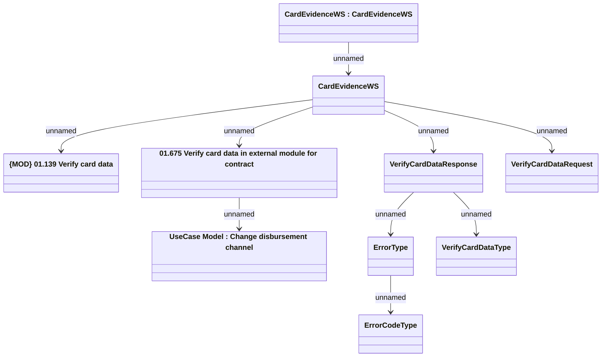

# CardEvidenceWS - VerifyCardData

```mermaid
classDiagram
    class MOD_01_139_Verify_card_data["{MOD} 01.139 Verify card data"]
    class UseCase_Model_Change_disbursement_channel["UseCase Model : Change disbursement channel"]
    class n_01_675_Verify_card_data_in_external_module_for_contract["01.675 Verify card data in external module for contract"]
    class CardEvidenceWS_CardEvidenceWS["CardEvidenceWS : CardEvidenceWS"]
    class ErrorType["ErrorType"]
    class ErrorCodeType["ErrorCodeType"]
    class VerifyCardDataResponse["VerifyCardDataResponse"]
    class VerifyCardDataType["VerifyCardDataType"]
    class VerifyCardDataRequest["VerifyCardDataRequest"]
    class CardEvidenceWS["CardEvidenceWS"]
    CardEvidenceWS_CardEvidenceWS --> CardEvidenceWS : unnamed
    CardEvidenceWS --> VerifyCardDataRequest : unnamed
    VerifyCardDataResponse --> VerifyCardDataType : unnamed
    CardEvidenceWS --> VerifyCardDataResponse : unnamed
    ErrorType --> ErrorCodeType : unnamed
    VerifyCardDataResponse --> ErrorType : unnamed
    CardEvidenceWS --> n_01_675_Verify_card_data_in_external_module_for_contract : unnamed
    CardEvidenceWS --> MOD_01_139_Verify_card_data : unnamed
    n_01_675_Verify_card_data_in_external_module_for_contract --> UseCase_Model_Change_disbursement_channel : unnamed
```
