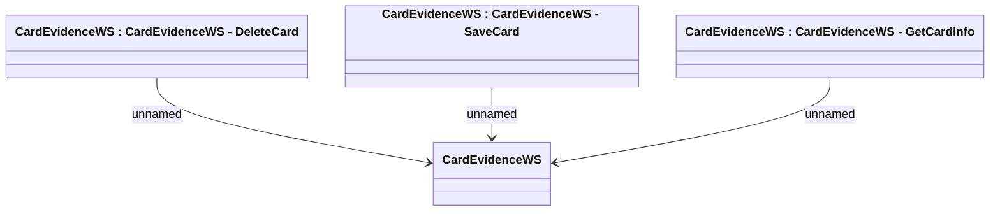

# CardEvidenceWS

- **Diagram Type**: Logical
- **Package**: HomerSelect/BSL/Analysis Model/_Interface/Consumed services/Card Evidence System/CardEvidenceWS
- **Diagram ID**: 136013
- **Elements**: 4
- **Connectors**: 3

