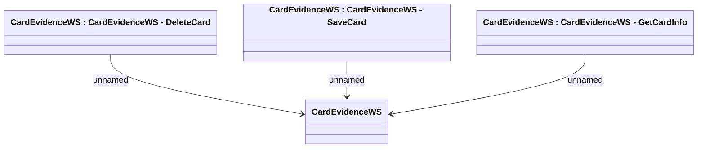

# CardEvidenceWS

```mermaid
classDiagram
    class CardEvidenceWS_CardEvidenceWS_DeleteCard["CardEvidenceWS : CardEvidenceWS - DeleteCard"]
    class CardEvidenceWS_CardEvidenceWS_SaveCard["CardEvidenceWS : CardEvidenceWS - SaveCard"]
    class CardEvidenceWS_CardEvidenceWS_GetCardInfo["CardEvidenceWS : CardEvidenceWS - GetCardInfo"]
    class CardEvidenceWS["CardEvidenceWS"]
    CardEvidenceWS_CardEvidenceWS_DeleteCard --> CardEvidenceWS : unnamed
    CardEvidenceWS_CardEvidenceWS_SaveCard --> CardEvidenceWS : unnamed
    CardEvidenceWS_CardEvidenceWS_GetCardInfo --> CardEvidenceWS : unnamed
```
