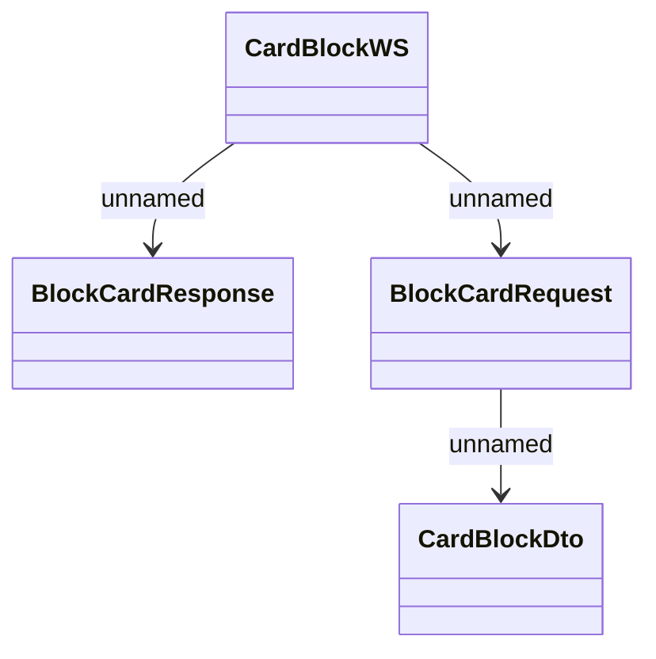

# CardBlockWS.BlockCard

```mermaid
classDiagram
    class CardBlockDto["CardBlockDto"]
    class BlockCardResponse["BlockCardResponse"]
    class BlockCardRequest["BlockCardRequest"]
    class CardBlockWS["CardBlockWS"]
    CardBlockWS --> BlockCardRequest : unnamed
    CardBlockWS --> BlockCardResponse : unnamed
    BlockCardRequest --> CardBlockDto : unnamed
```
