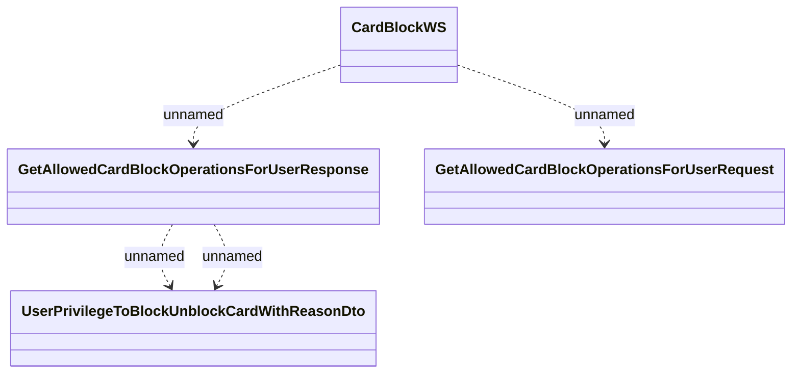

# CardBlockWS.GetAllowedCardBlockOperationsForUser

- **Diagram Type**: Logical
- **Package**: HomerSelect/BSL/Analysis Model/_Interface/Consumed services/Card Management System/CardBlockWS
- **Diagram ID**: 100766
- **Elements**: 4
- **Connectors**: 4

