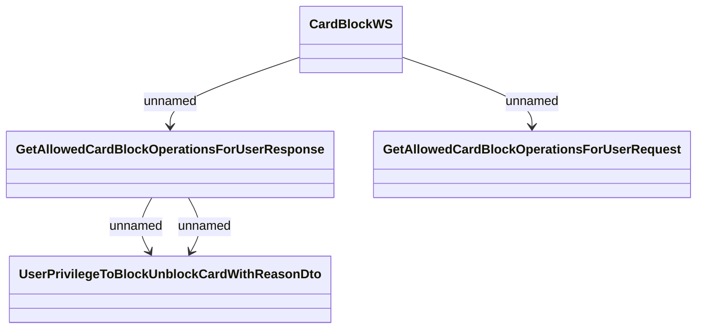

# CardBlockWS.GetAllowedCardBlockOperationsForUser

```mermaid
classDiagram
    class CardBlockWS["CardBlockWS"]
    class UserPrivilegeToBlockUnblockCardWithReasonDto["UserPrivilegeToBlockUnblockCardWithReasonDto"]
    class GetAllowedCardBlockOperationsForUserResponse["GetAllowedCardBlockOperationsForUserResponse"]
    class GetAllowedCardBlockOperationsForUserRequest["GetAllowedCardBlockOperationsForUserRequest"]
    CardBlockWS --> GetAllowedCardBlockOperationsForUserRequest : unnamed
    CardBlockWS --> GetAllowedCardBlockOperationsForUserResponse : unnamed
    GetAllowedCardBlockOperationsForUserResponse --> UserPrivilegeToBlockUnblockCardWithReasonDto : unnamed
    GetAllowedCardBlockOperationsForUserResponse --> UserPrivilegeToBlockUnblockCardWithReasonDto : unnamed
```
