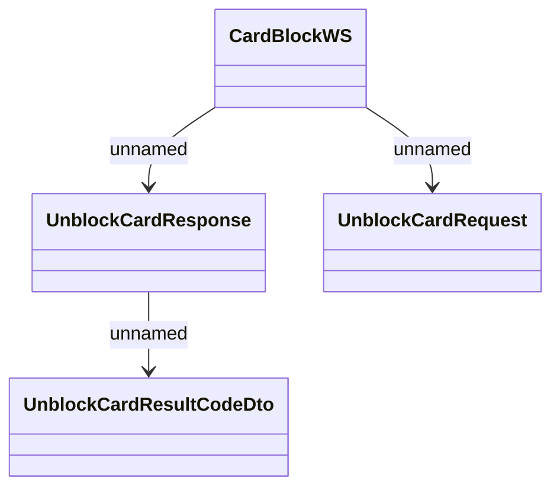

# CardBlockWS.UnblockCard

```mermaid
classDiagram
    class UnblockCardResultCodeDto["UnblockCardResultCodeDto"]
    class CardBlockWS["CardBlockWS"]
    class UnblockCardResponse["UnblockCardResponse"]
    class UnblockCardRequest["UnblockCardRequest"]
    CardBlockWS --> UnblockCardRequest : unnamed
    CardBlockWS --> UnblockCardResponse : unnamed
    UnblockCardResponse --> UnblockCardResultCodeDto : unnamed
```
