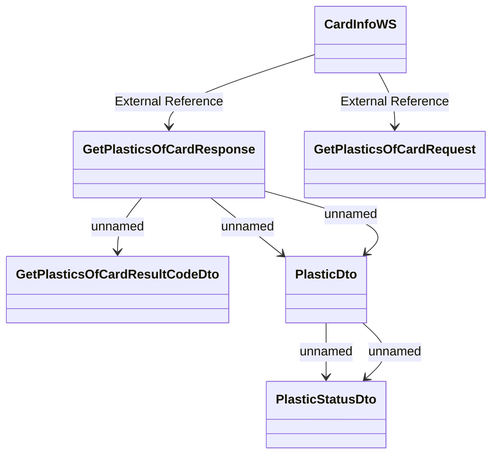

# CardInfoWS.GetPlasticsOfCard

```mermaid
classDiagram
    class GetPlasticsOfCardResultCodeDto["GetPlasticsOfCardResultCodeDto"]
    class PlasticDto["PlasticDto"]
    class PlasticStatusDto["PlasticStatusDto"]
    class PlasticStatusDto["PlasticStatusDto"]
    class PlasticDto["PlasticDto"]
    class GetPlasticsOfCardResponse["GetPlasticsOfCardResponse"]
    class GetPlasticsOfCardRequest["GetPlasticsOfCardRequest"]
    class CardInfoWS["CardInfoWS"]
    CardInfoWS --> GetPlasticsOfCardRequest : External Reference
    CardInfoWS --> GetPlasticsOfCardResponse : External Reference
    GetPlasticsOfCardResponse --> PlasticDto : unnamed
    GetPlasticsOfCardResponse --> PlasticDto : unnamed
    GetPlasticsOfCardResponse --> GetPlasticsOfCardResultCodeDto : unnamed
    PlasticDto --> PlasticStatusDto : unnamed
    PlasticDto --> PlasticStatusDto : unnamed
```
