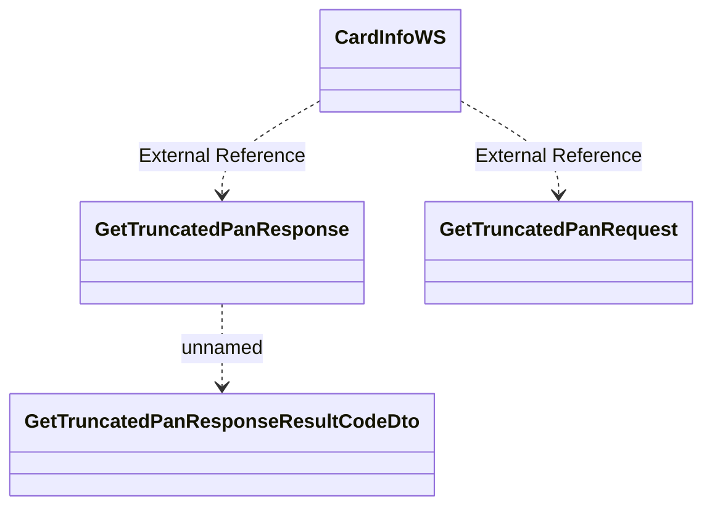

# CardInfoWS.GetTruncatedPan

- **Diagram Type**: Logical
- **Package**: HomerSelect/BSL/Analysis Model/_Interface/Consumed services/Card Management System/CardInfoWS/CardInfoWS_v1
- **Diagram ID**: 135379
- **Elements**: 4
- **Connectors**: 3

