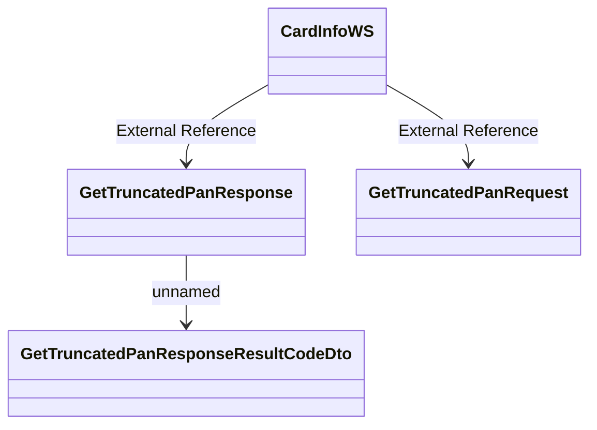

# CardInfoWS.GetTruncatedPan

```mermaid
classDiagram
    class GetTruncatedPanResponseResultCodeDto["GetTruncatedPanResponseResultCodeDto"]
    class GetTruncatedPanResponse["GetTruncatedPanResponse"]
    class GetTruncatedPanRequest["GetTruncatedPanRequest"]
    class CardInfoWS["CardInfoWS"]
    CardInfoWS --> GetTruncatedPanRequest : External Reference
    CardInfoWS --> GetTruncatedPanResponse : External Reference
    GetTruncatedPanResponse --> GetTruncatedPanResponseResultCodeDto : unnamed
```
