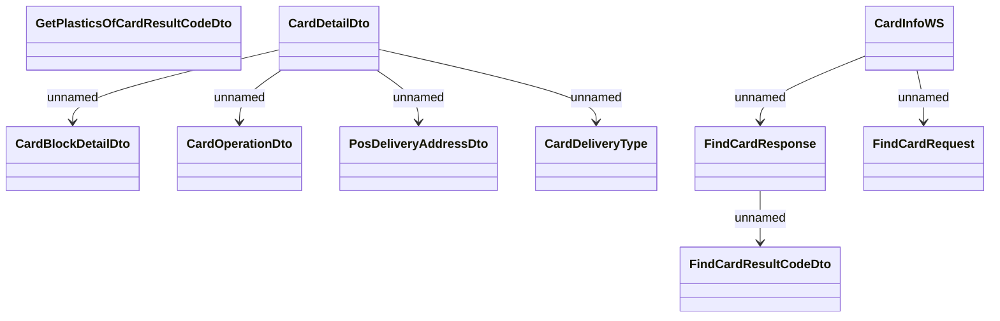

# CardInfoWS.FindCard

```mermaid
classDiagram
    class GetPlasticsOfCardResultCodeDto["GetPlasticsOfCardResultCodeDto"]
    class CardBlockDetailDto["CardBlockDetailDto"]
    class CardOperationDto["CardOperationDto"]
    class PosDeliveryAddressDto["PosDeliveryAddressDto"]
    class CardDeliveryType["CardDeliveryType"]
    class CardDetailDto["CardDetailDto"]
    class FindCardResultCodeDto["FindCardResultCodeDto"]
    class FindCardResponse["FindCardResponse"]
    class FindCardRequest["FindCardRequest"]
    class CardInfoWS["CardInfoWS"]
    CardInfoWS --> FindCardRequest : unnamed
    CardInfoWS --> FindCardResponse : unnamed
    FindCardResponse --> FindCardResultCodeDto : unnamed
    CardDetailDto --> CardDeliveryType : unnamed
    CardDetailDto --> PosDeliveryAddressDto : unnamed
    CardDetailDto --> CardOperationDto : unnamed
    CardDetailDto --> CardBlockDetailDto : unnamed
```
