# CardInfoWS.GetCard

- **Diagram Type**: Logical
- **Package**: HomerSelect/BSL/Analysis Model/_Interface/Consumed services/Card Management System/CardInfoWS/CardInfoWS_v2
- **Diagram ID**: 135381
- **Elements**: 32
- **Connectors**: 32

```mermaid
classDiagram
    class Subdistrict["Subdistrict"]
    class CardDeliveryType["CardDeliveryType"]
    class PlasticStatusDto["PlasticStatusDto"]
    class PeriodDto["PeriodDto"]
    class EcommerceStatusDto["EcommerceStatusDto"]
    class CardStatusDto["CardStatusDto"]
    class CardOperationDto["CardOperationDto"]
    class AccountTypeDto["AccountTypeDto"]
    class PlasticDto["PlasticDto"]
    class Zip["Zip"]
    class TruncatedPan["TruncatedPan"]
    class Town["Town"]
    class Street["Street"]
    class SellerPlaceCode["SellerPlaceCode"]
    class Region["Region"]
    class PosDeliveryAddressDto["PosDeliveryAddressDto"]
    class PermanentLimitDto["PermanentLimitDto"]
    class HouseNumber["HouseNumber"]
    class FlatNumber["FlatNumber"]
    class District["District"]
    class CurrentValueChoice["CurrentValueChoice"]
    class CardTypeDto["CardTypeDto"]
    class CardDto["CardDto"]
    class CardDetailDto["CardDetailDto"]
    class CardBlockDetailDto["CardBlockDetailDto"]
    class BlockNumber["BlockNumber"]
    class AccountDto["AccountDto"]
    class AbstractLimitDto["AbstractLimitDto"]
    class TemporaryLimitDto["TemporaryLimitDto"]
    class GetCardResponse["GetCardResponse"]
    class GetCardRequest["GetCardRequest"]
    class CardInfoWS["CardInfoWS"]
    AccountDto ..> AccountTypeDto : unnamed
    PosDeliveryAddressDto ..> Subdistrict : unnamed
    PosDeliveryAddressDto ..> SellerPlaceCode : unnamed
    PosDeliveryAddressDto ..> Street : unnamed
    PosDeliveryAddressDto ..> Town : unnamed
    CardDto ..> TruncatedPan : unnamed
    CardDetailDto ..> PosDeliveryAddressDto : unnamed
    CardDetailDto ..> PlasticDto : unnamed
    CardDetailDto ..> PermanentLimitDto : unnamed
    CardDetailDto ..> CardOperationDto : unnamed
    CardDto ..> CardStatusDto : unnamed
    CardDto ..> EcommerceStatusDto : unnamed
    AbstractLimitDto ..> PeriodDto : unnamed
    PlasticDto ..> PlasticStatusDto : unnamed
    CardDetailDto ..> CardDeliveryType : unnamed
    PosDeliveryAddressDto ..> Zip : unnamed
    GetCardResponse ..> CardDetailDto : unnamed
    CardInfoWS ..> GetCardResponse : unnamed
    CardDetailDto ..> TemporaryLimitDto : unnamed
    AbstractLimitDto <|-- PermanentLimitDto : unnamed
    AbstractLimitDto <|-- TemporaryLimitDto : unnamed
    CardDto ..> AccountDto : unnamed
    PosDeliveryAddressDto ..> Region : unnamed
    CardDetailDto ..> CardBlockDetailDto : unnamed
    CardInfoWS ..> GetCardRequest : unnamed
    CardDto <|-- CardDetailDto : unnamed
    CardDto ..> CardTypeDto : unnamed
    AbstractLimitDto --> CurrentValueChoice : unnamed
    PosDeliveryAddressDto ..> District : unnamed
    PosDeliveryAddressDto ..> FlatNumber : unnamed
    PosDeliveryAddressDto ..> HouseNumber : unnamed
    PosDeliveryAddressDto ..> BlockNumber : unnamed
```

