# CardInfoWS.GetPlasticsOfCard

- **Diagram Type**: Logical
- **Package**: HomerSelect/BSL/Analysis Model/_Interface/Consumed services/Card Management System/CardInfoWS/CardInfoWS_v2
- **Diagram ID**: 135383
- **Elements**: 8
- **Connectors**: 7

```mermaid
classDiagram
    class GetPlasticsOfCardResultCodeDto["GetPlasticsOfCardResultCodeDto"]
    class PlasticDto["PlasticDto"]
    class PlasticStatusDto["PlasticStatusDto"]
    class PlasticStatusDto["PlasticStatusDto"]
    class PlasticDto["PlasticDto"]
    class GetPlasticsOfCardResponse["GetPlasticsOfCardResponse"]
    class GetPlasticsOfCardRequest["GetPlasticsOfCardRequest"]
    class CardInfoWS["CardInfoWS"]
    CardInfoWS ..> GetPlasticsOfCardRequest : unnamed
    CardInfoWS ..> GetPlasticsOfCardResponse : unnamed
    GetPlasticsOfCardResponse ..> PlasticDto : unnamed
    PlasticDto ..> PlasticStatusDto : unnamed
    PlasticDto ..> PlasticStatusDto : unnamed
    GetPlasticsOfCardResponse ..> PlasticDto : unnamed
    GetPlasticsOfCardResponse ..> GetPlasticsOfCardResultCodeDto : unnamed
```

