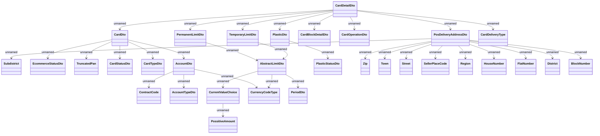

# CardInfoWS - types

```mermaid
classDiagram
    class Subdistrict["Subdistrict"]
    class EcommerceStatusDto["EcommerceStatusDto"]
    class TruncatedPan["TruncatedPan"]
    class CardStatusDto["CardStatusDto"]
    class CardTypeDto["CardTypeDto"]
    class ContractCode["ContractCode"]
    class AccountTypeDto["AccountTypeDto"]
    class AccountDto["AccountDto"]
    class CardDto["CardDto"]
    class PossitiveAmount["PossitiveAmount"]
    class CurrentValueChoice["CurrentValueChoice"]
    class CurrencyCodeType["CurrencyCodeType"]
    class PeriodDto["PeriodDto"]
    class AbstractLimitDto["AbstractLimitDto"]
    class PermanentLimitDto["PermanentLimitDto"]
    class TemporaryLimitDto["TemporaryLimitDto"]
    class PlasticDto["PlasticDto"]
    class PlasticStatusDto["PlasticStatusDto"]
    class CardBlockDetailDto["CardBlockDetailDto"]
    class CardOperationDto["CardOperationDto"]
    class Zip["Zip"]
    class Town["Town"]
    class Street["Street"]
    class SellerPlaceCode["SellerPlaceCode"]
    class Region["Region"]
    class HouseNumber["HouseNumber"]
    class FlatNumber["FlatNumber"]
    class District["District"]
    class BlockNumber["BlockNumber"]
    class PosDeliveryAddressDto["PosDeliveryAddressDto"]
    class CardDeliveryType["CardDeliveryType"]
    class CardDetailDto["CardDetailDto"]
    CardDto --> AccountDto : unnamed
    TemporaryLimitDto --> AbstractLimitDto : unnamed
    AbstractLimitDto --> PeriodDto : unnamed
    AbstractLimitDto --> CurrencyCodeType : unnamed
    AccountDto --> CurrencyCodeType : unnamed
    AbstractLimitDto --> CurrentValueChoice : unnamed
    PosDeliveryAddressDto --> Subdistrict : unnamed
    CardDetailDto --> CardDto : unnamed
    CardDetailDto --> TemporaryLimitDto : unnamed
    AccountDto --> AccountTypeDto : unnamed
    AccountDto --> ContractCode : unnamed
    CardDto --> CardTypeDto : unnamed
    CardDto --> CardStatusDto : unnamed
    CardDto --> TruncatedPan : unnamed
    CardDto --> EcommerceStatusDto : unnamed
    CurrentValueChoice --> PossitiveAmount : unnamed
    PosDeliveryAddressDto --> Town : unnamed
    CardDetailDto --> PosDeliveryAddressDto : unnamed
    PosDeliveryAddressDto --> BlockNumber : unnamed
    PosDeliveryAddressDto --> District : unnamed
    PosDeliveryAddressDto --> FlatNumber : unnamed
    PosDeliveryAddressDto --> HouseNumber : unnamed
    PosDeliveryAddressDto --> Region : unnamed
    PermanentLimitDto --> AbstractLimitDto : unnamed
    PosDeliveryAddressDto --> Street : unnamed
    CardDetailDto --> PermanentLimitDto : unnamed
    PosDeliveryAddressDto --> Zip : unnamed
    CardDetailDto --> CardOperationDto : unnamed
    CardDetailDto --> CardBlockDetailDto : unnamed
    PlasticDto --> PlasticStatusDto : unnamed
    CardDetailDto --> PlasticDto : unnamed
    CardDetailDto --> CardDeliveryType : unnamed
    PosDeliveryAddressDto --> SellerPlaceCode : unnamed
```
