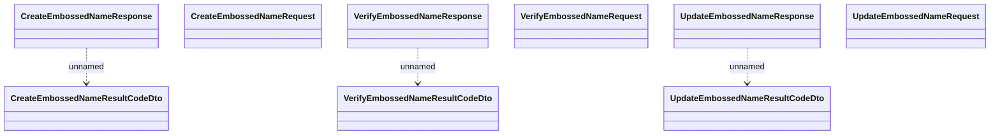

# CardModificationWS - messages

- **Diagram Type**: Logical
- **Package**: HomerSelect/BSL/Analysis Model/_Interface/Consumed services/Card Management System/CardModificationWS/CardModificationWS_v2/Messages
- **Diagram ID**: 135393
- **Elements**: 9
- **Connectors**: 3

