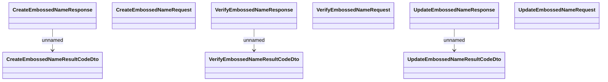

# CardModificationWS - messages

```mermaid
classDiagram
    class CreateEmbossedNameResultCodeDto["CreateEmbossedNameResultCodeDto"]
    class CreateEmbossedNameResponse["CreateEmbossedNameResponse"]
    class CreateEmbossedNameRequest["CreateEmbossedNameRequest"]
    class VerifyEmbossedNameResultCodeDto["VerifyEmbossedNameResultCodeDto"]
    class VerifyEmbossedNameResponse["VerifyEmbossedNameResponse"]
    class VerifyEmbossedNameRequest["VerifyEmbossedNameRequest"]
    class UpdateEmbossedNameResultCodeDto["UpdateEmbossedNameResultCodeDto"]
    class UpdateEmbossedNameResponse["UpdateEmbossedNameResponse"]
    class UpdateEmbossedNameRequest["UpdateEmbossedNameRequest"]
    UpdateEmbossedNameResponse --> UpdateEmbossedNameResultCodeDto : unnamed
    VerifyEmbossedNameResponse --> VerifyEmbossedNameResultCodeDto : unnamed
    CreateEmbossedNameResponse --> CreateEmbossedNameResultCodeDto : unnamed
```
