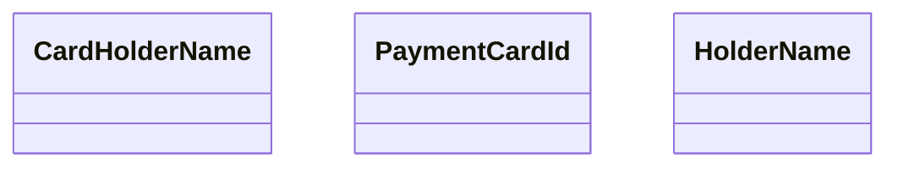

# CardModificationWS - types

- **Diagram Type**: Logical
- **Package**: HomerSelect/BSL/Analysis Model/_Interface/Consumed services/Card Management System/CardModificationWS/CardModificationWS_v1/Types
- **Diagram ID**: 135681
- **Elements**: 3
- **Connectors**: 0

